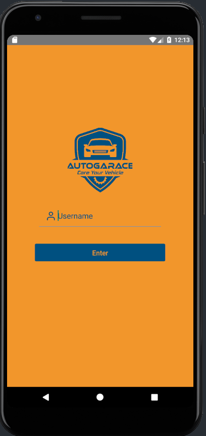
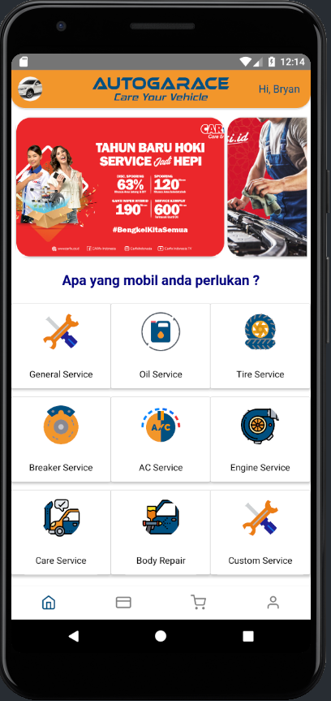
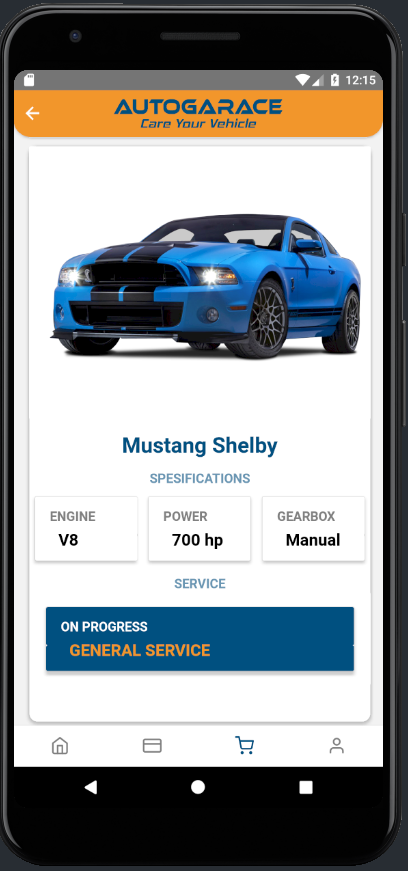
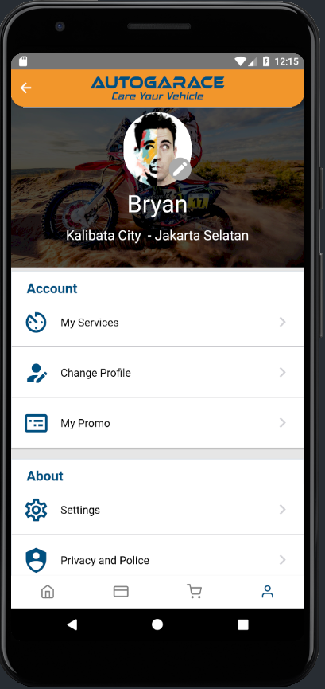

<!-- This project was bootstrapped with [Create React App](https://github.com/facebook/create-react-app). -->

## Mobile App AUTOGARACE

This is my personal mobile app project that I developed using React Native. An mobile app for car service business. This app being developed, and now on progress in front-end.

<!-- 

 -->

### Library Used (Front End)
- [React Native](https://reactnative.dev/) for layouting and make component.
- [React Navigation](https://reactnavigation.org/) for make app navigation.
- [React Native Elements](https://react-native-elements.github.io/react-native-elements/) for make component.
- [Native Base](https://nativebase.io/) for make make component.